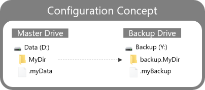
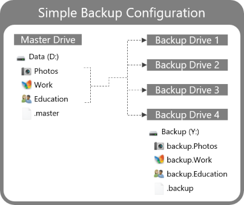
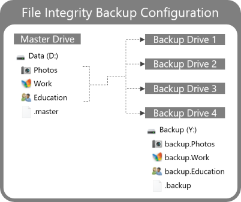
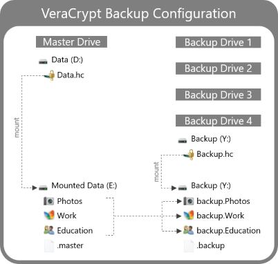
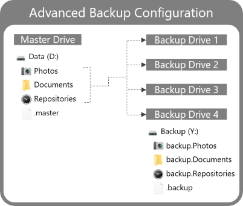

[](https://goreportcard.com/report/github.com/aicirt2012/robobackup)
[](https://www.gnu.org/licenses/gpl-3.0)

# RoboBackup

RoboBackup is a simplistic backup utility that allows to create fast and reliable backups with optional file integrity checks. 

**Key Design Principles:**
* Keep it simple, stupid (KISS)
* Backup files should be usable right away, no dependency on any proprietary format
* Fast and reliable backup process
* Backup integrity is verifiable without source files
* Simple file-based configuration that supports external devices securely

**Primary Implementation Approach:**
* A command line interface ensures the implementation is as simple as possible and easy to maintain long term.
* The backup process is implemented based on Microsoft Robocopy which is responsible to mirror all files from the source to the target destination. Incremental or differential backups are not supported which allows to check created backups easy manually if needed. Most important, the backup files can be used as drop-in replacement for the source files without any restore operation. Robocopy internally copies not existing or modified files to the target to prevent unnecessary disk io which allows fast progress. Deleted source files are deleted on the target as well. 
* Optionally, before a backup is started, an integrity file can be generated that contains file metadata and a hash for each file. The generation of the integrity file is incremental to prevent expensive hash calculation performed unnecessarily. Since this file is contained within the source folder, when the backup is started this file is part of the backup process, which allows to verify the backup integrity independent of the source afterward. For further cross-platform support, file system specific features such as alternative data stream are not used. 
* A simple yaml format allows to configure backup jobs. Source and target paths are declared with drive identifiers instead of hard-wired drive letters which may change for external drives over time. Drive identifies are represented with a hidden file named as the identifier on root level of a drive. This approach allows to resolve drive letters dynamically at runtime. Additionally, all target folders must have a prefix `backup.`. Both mechanisms alone prevent to accidentally swap source and target at any time.

**Limitations:**
* Robocopy is Windows specific and therefore other operating systems not supported. All other dependencies are ready for cross-platform compilation. 

## Usage

**1. Download the binary** from the latest release and unzip the executable to your desired location.

**2. Create a configuration file** located in the same folder as the executable with the following naming convention `*.robobackup.yaml`, e.g. `personal.robobackup.yaml`. A configuration file can contain multiple job declarations. Each job declaration requires at least three properties that are the `name`, `source` and `target`. The latter two describe locations. 

A location is described with the pattern `<driveId>?<relativePath>`. This means to identify a drive, a drive id file with unique name must be created. In this example, the absolute path `D:\MyDir` is expressed as `.myData?\MyDir`. 

_Hint: This concept prevents to accidentally swap source and target of removable devices where drive letters are assigned dynamically. If non-unique drive ids are detected, the cli shows an error and the execution is not performed._



Configuration file named `personal.robobackup.yaml`:

```yaml
version: "2.2.0"
jobs:
- name: MyDir
  source: .myData?\MyDir
  target: .myBackup?\backup.MyDir
```

**3. Start the executable** with admin privileges and follow the command line interface instructions:
```terminal
$ .\robobackup.exe

================================================================================
::::: RoboBackup Utility :::::::::::::::::::::::::::::::::::::::::::::::::::::::
::::: v2.2.0  2024-01-07 13:04:07 ::::::::::::::::::::::::::::::::::::::::::::::
================================================================================

Please select mode:
[0] Backup
[1] Manual verification
Type option: 0

Please select jobs to be executed:
[0] D:\MyDir => Y:\backup.MyDir
[1] All
Type option: 1

Following jobs are selected for execution:
D:\MyDir => Y:\backup.MyDir

Please confirm execution with '128': 128

...

-------------------------------------------------------------------------------
   ROBOCOPY     ::     Robust File Copy for Windows
-------------------------------------------------------------------------------

               Total    Copied   Skipped  Mismatch    FAILED    Extras
    Dirs :        21         2        19         0         0         0
   Files :      2860        15      2845         0         0         0
```

### Simple Backup Configuration
In contrast to the previous concept example, a real world backup strategy requires multiple backup targets. The simple configuration uses a similar drive id file to identify all backup drives, this allows to reuse the same configuration file for all backup drives. This example uses the drive id `.master` to identify the source device and `.backup` to identify the backup drives. 



Configuration file named ```master.robobackup.yaml```:
```yaml
version: "2.2.0"
jobs:
- name: Photos
  source: .master?\Photos
  target: .backup?\backup.Photos
- name: Work
  source: .master?\Work
  target: .backup?\backup.Work
- name: Education
  source: .master?\Education
  target: .backup?\backup.Education
```

### File Integrity Backup Configuration
Besides the classic backup options, a file integrity index can be created optionally, before a backup job is executed. The initial creation of a file integrity index is resources and time-consuming. Updating an existing file integrity index is very fast considering, typically only a few files change over time. To verify the file integrity, RoboBackup can be used or the file integrity cli itself. The cli version also allow to find duplicate files in seconds based on the file integrity index. For more details see [file integrity repository](https://github.com/aicirt2012/fileintegrity).



Configuration file named ```master.robobackup.yaml```:
```yaml
version: "2.2.0"
jobs:
- name: Photos
  source: .master?\Photos
  target: .backup?\backup.Photos
  options:
    integrity:
      upsert: true
- name: Work
  source: .master?\Work
  target: .backup?\backup.Work
  options:
    integrity:
      upsert: true
- name: Education
  source: .master?\Education
  target: .backup?\backup.Education
  options:
    integrity:
      upsert: true
```

### VeraCrypt Backup Configuration
If encryption is desired, [VeraCrypt](https://veracrypt.fr/) can be used as additional layer. Either the entire drive can be encrypted or encrypted file containers can be used. It's strongly recommended to use encrypted file containers, since entirely encrypted drives are recognized as unformated. As result, windows offers to format those drives which would delete all data. In general, any other encryption tools can be used as well. The configuration itself is similar to any other presented sample, just mount the encrypted volumes before execution.



### Advanced Backup Configuration
This sample illustrates a combination of different configuration options. The `Photo` directory, is backed up with default options. Before the `Documents` directory is backed up, the file integrity index is created or updated. Similar for the `Repository` directory with the exception, that folders named `node_modules` are ignored. In general, as many folders as desired can be ignored. In order to test a configuration, the `dry-run` flag might be set. To structure your configuration semantically, it can be helpful to create multiple configuration files. E.g.: `laptop.robobackup.yaml` and `desktop.robobackup.yaml`.



Configuration file named ```master.robobackup.yaml```:
```yaml
version: "2.2.0"
jobs:
- name: Photos
  source: .master?\Photos
  target: .backup?\backup.Photos
- name: Documents
  source: .master?\Documents
  target: .backup?\backup.Documents
  options:
    integrity:
      upsert: true
- name: Repositories
  source: .master?\Repositories
  target: .backup?\backup.Repositories
  options:
    mir:
      dry-run: false
      exclude-dirs:
        - node_modules
    integrity:
      upsert: true
```

## Development

**Run**
```
$ go run main.go
```

**Tests**
```
$ go test ./...         // All tests
$ go test ./src/...     // Unit tests
$ go test ./tests/...   // Integration tests
```

**Build**
```
$ go build main.go
```

